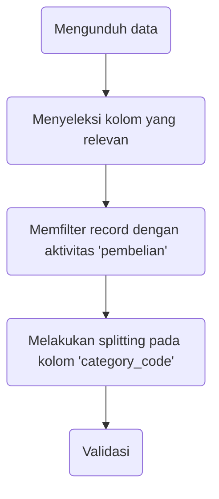

# Data Cleaning in Shell

Percobaan melakukan data cleaning melalui Shell pada data traffic e-commerce.

## Detail Kerja

Data digunakan tersimpan pada folder `data/` dua file `2019-Oct-sample.csv` dan `2019-Nov-sample.csv` dengan kolom-kolom
`event_time`,
`event_type`,
`product_id`,
`category_id`,
`category_code`,
`brand`,
`price`,
`user_id`,
`user_session`

Langkah-langkah kerja diatas dilakukan satu per satu melalui Shell. Kumpulan dari command yang digunakan dapat dilihat pada skrip `DCiS.sh`.

## Cara Penggunaan Program

Skrip `DCiS.sh` dapat dijalankan jika dieksekusi pada directory yang memiliki folder `data/` berisikan dua file `2019-Oct-sample.csv` dan `2019-Nov-sample.csv`.

Hasil dari program adalah file `data_cleaned.csv` yang memenuhi detail kerja di atas.

## Saran Perbaikan

Skrip `DCiS.sh` dapat diperbaiki sehingga dapat menerima data traffic dengan format yang sama lainnya.
